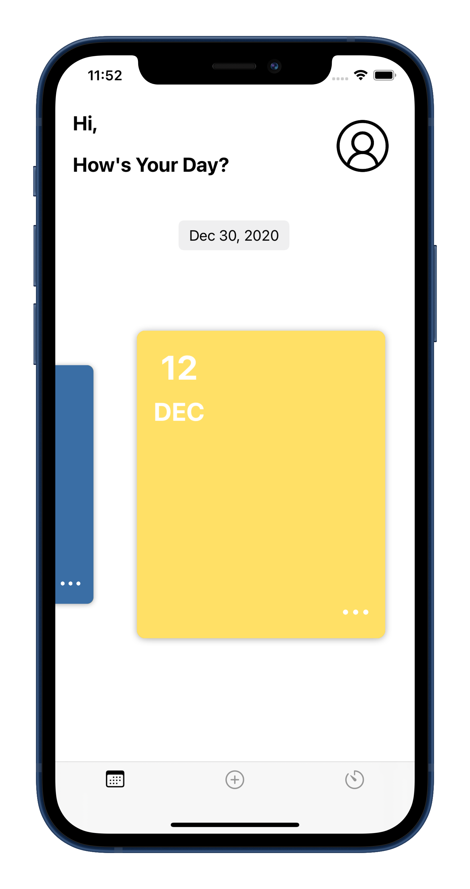
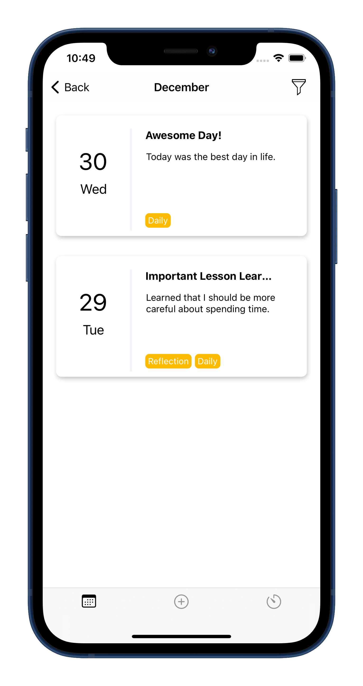
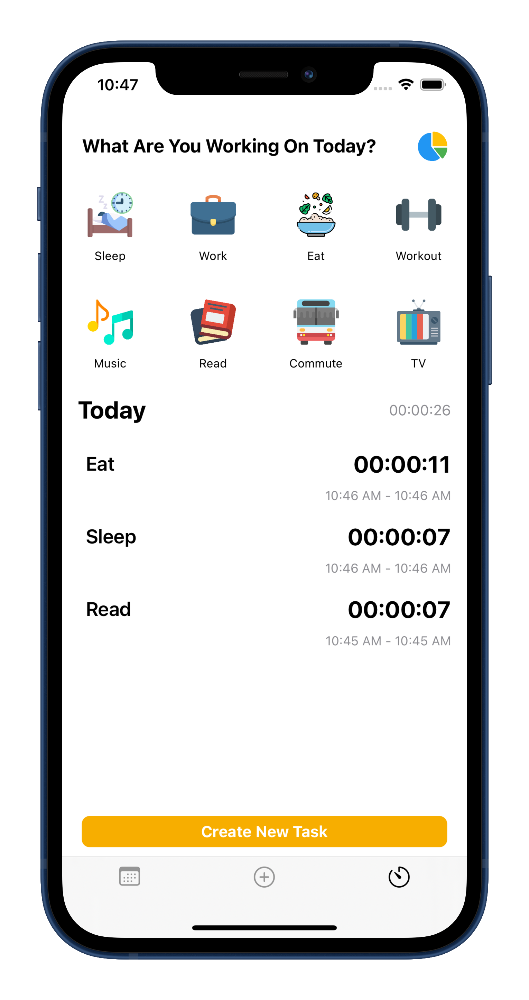
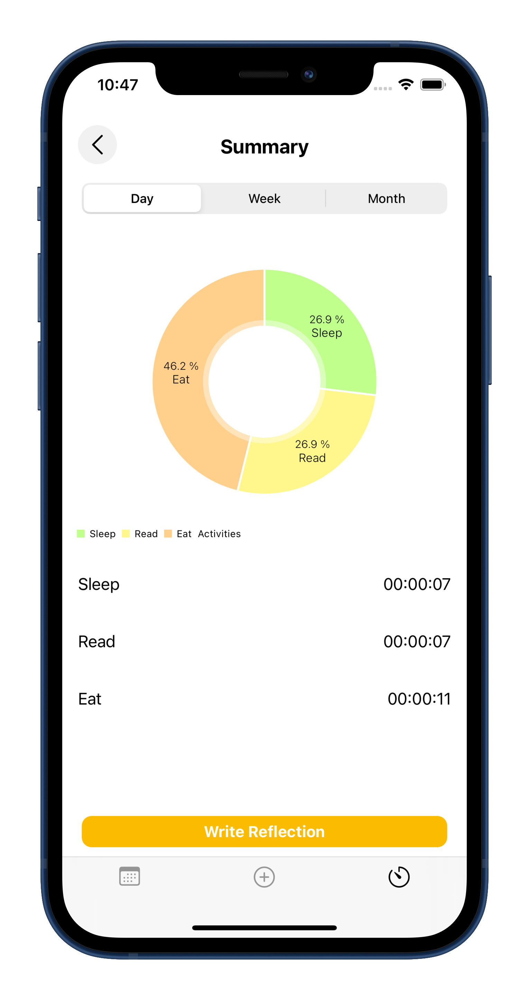
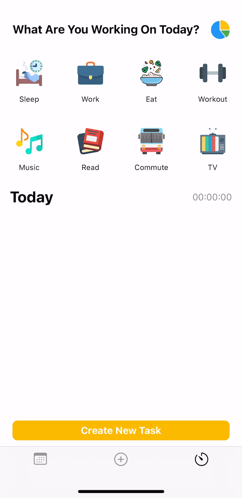

# EachDay
<h1 align="center">
  
</h1>
<h4 align="center">A simple yet elegantly designed journaling and time tracker app for those who enjoy recording life events.</h4>

  <a href="#about">About</a> •
  <a href="#motivation">Motivation</a> •
  <a href="screenshots">Screenshots</a> •
  <a href="#demo">Demo</a> •
  <a href="#third-party-libraries">Third Party Libraries</a> 

## About
Each Day is an app that allows users to record life events, whether significant or minute, via a simple journal. Simultaneously, users can track their time spent each day and reflect with a pie chart. 

## Motivation
We live only once. To make the best out of life, I believe it's important to aim to become a better person by cautiously planning out how we spend our time each day and recording the best memories everyday. Each day is unique and exciting, and I hope this app could become a tool to assist people on achieving their own goals or dream life.  

## Features
* **Time Capsule**  
 Ever wanted to say something to your future-self? Select a time and send some encouragement to you with our unlimited time caps!
* **Time Tracker Summary**  
  Quick and easy way to aggregate your tracked time for each day, week, or month in a pie chart. Clean and comprehensive data provided for you to reflect on your productivity at a breeze.
* **Passcode/FaceID**  
  Don’t want other people to read your diary? Rest assured. Secure your data with passcode and FaceID/TouchID and write freely in Each Day.
* **Customizable Theme**  
  If you’re feeling different each month, change the theme color for that month’s card! Up to 15 colors are available, and more colors are coming soon in the future.
* **Journal Tags**  
  Classify your journals with customizable tags and conveniently filter journals with them whenever you desire.
  
## Screenshots

  
  

  
  

## Demo 
 
 
 

## Third Party Libraries
* [Alamofire](https://github.com/Alamofire/Alamofire)
* [Firebase](https://firebase.google.com/)
* [Lottie](https://github.com/airbnb/lottie-ios)
* [IQKeyboardManager](https://github.com/hackiftekhar/IQKeyboardManager)
* [Charts](https://github.com/danielgindi/Charts)
* [SVPinView](https://github.com/xornorik/SVPinView)
* [YPImagePicker](https://github.com/Yummypets/YPImagePicker)
* [FAPaginationLayout](https://github.com/fahidattique55/FAPaginationLayout)
* [KeychainAccess](https://github.com/kishikawakatsumi/KeychainAccess)

## Author
Eleanor Peng – eleanorpeng31@gmail.com

## License
Distributed under the MIT License. See ``LICENSE`` for more information.
